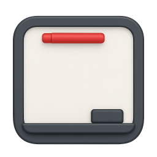
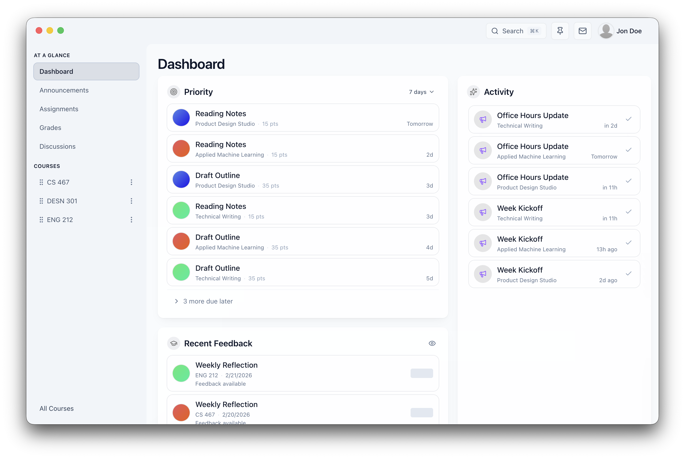

  

  

<em>Whiteboard is a fast, focused desktop companion for Canvas.</em>

## Disclaimer
Whiteboard is not affiliated with Instructure. Canvas LMS is a registered trademark of Instructure, Inc.

Whiteboard is a Canvas LMS client designed to make coursework feel organized and calm again. It brings your classes, assignments, announcements, grades, and files into one place so you can spend less time clicking around and more time getting things done.

## Why Whiteboard
Canvas works, but it can feel slow and cluttered in a browser. Even as a PWA, it does not feel native: there are no real desktop notifications, no global search, and too many steps just to jump between courses, tasks, and files.

Whiteboard fills those gaps by keeping course essentials within quick reach, helping you find anything fast, and making daily coursework feel more like a desktop app than a web page.

## Key features
- Desktop notifications for time‑sensitive updates.
- Global search across courses, files, pages, and discussions.
- Fast, desktop‑friendly navigation between courses and tasks.
- Built‑in viewers for PDFs, docs, and slides.
- Offline‑friendly caching for recently opened content.
- Optional on‑device AI tools.

## AI features
Whiteboard includes optional AI‑powered helpers that run on your device. Use them to quickly summarize long readings, pull out key points, and get faster answers from your course materials without sending your data to external AI services.

## Supported Providers
- Apple Intelligence ([afmbridge](https://github.com/obinnanwachukwu1/afmbridge))

## What it helps you do
- See upcoming work and deadlines across all courses.
- Catch announcements and discussions without digging through tabs.
- Search across courses, files, pages, and discussions.
- Open course files with built-in viewers for PDFs, docs, and slides.
- Check grades and explore "what-if" outcomes.
- Keep quick notes and key links close at hand.

## Getting started
1. Open the app.
2. Enter your Canvas base URL and access token.
3. Pick a course and start exploring your dashboard.

## Roadmap
- Smarter reminders for high‑priority deadlines.
- Deeper offline access for course content.
- Support more local providers (Phi Silica for Copilot+ PCs)

## FAQ
- **Where is my Canvas token stored?** Locally on your device.
- **Does any data leave my device?** Whiteboard only talks to your Canvas instance; your cache and search index stay local.
- **How do I revoke access?** Revoke the token in Canvas or clear it from Whiteboard settings.

## Privacy
Your Canvas token, cache, and search index are stored locally on your device. AI features (if enabled) run on‑device.

## For contributors
- Install dependencies: `pnpm install`
- Run checks: `pnpm exec tsc -p tsconfig.json --noEmit`, `pnpm lint`, and `pnpm test`
- Packaging on macOS arm64 fetches `afmbridge-server` automatically via `pnpm run prepare:afmbridge` (already wired into build scripts)

## Project docs
- [CONTRIBUTING](CONTRIBUTING.md)
- [SECURITY](SECURITY.md)
- [CODE_OF_CONDUCT](CODE_OF_CONDUCT.md)
- [SUPPORT](SUPPORT.md)
- [THIRD_PARTY_NOTICES](THIRD_PARTY_NOTICES.md)

## License
GPLv3. See [LICENSE](LICENSE).
